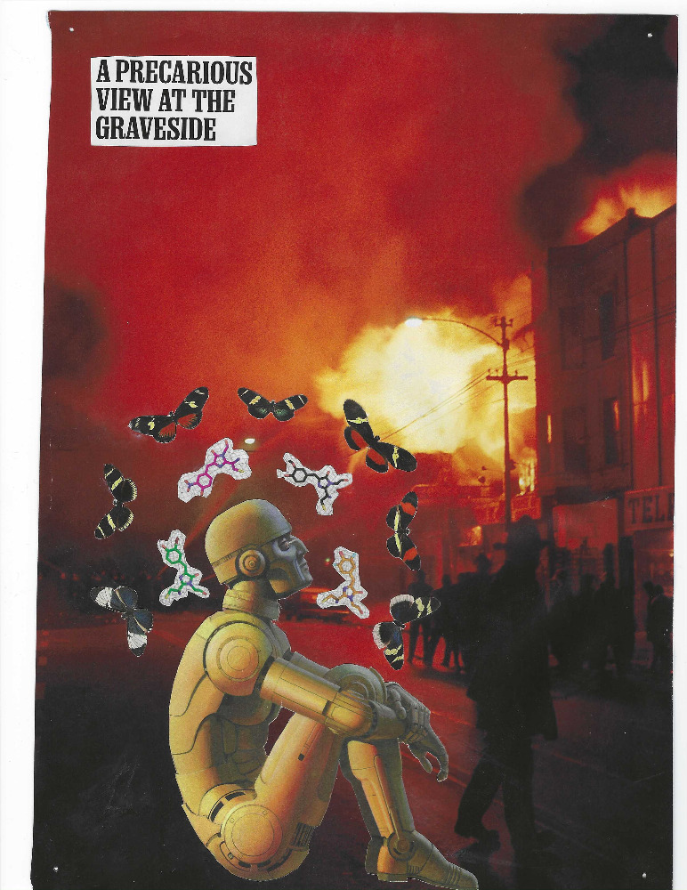
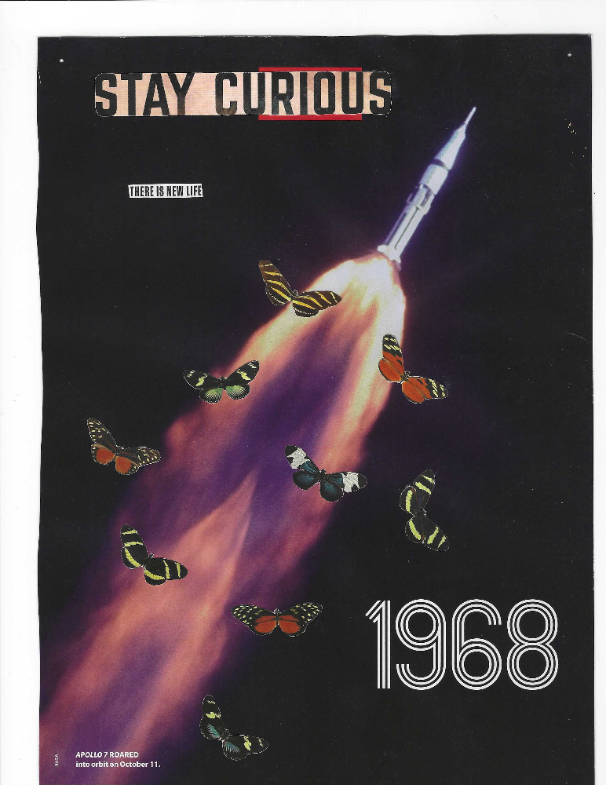

# Media

## The Graveside

I think wealth inequality is the most important issue of our time[^1].

In 1968 MLK was organizing the [Poor People's Campaign](https://en.wikipedia.org/wiki/Poor_People%27s_Campaign),
a movement that aimed to secure economic and human rights for poor people. In
essence, a decleration that all people should have what they need to live. A
call for an economic bill of rights.

While working on this campaign he declared the [Memphis sanitation strik](https://en.wikipedia.org/wiki/Memphis_sanitation_strike)
a major aspect of the campaign. Days before King arrived there was a storm of
press, "implying that the Memphis outbursts foreshadowed mass violence by the
Poor People's Campaign in Washington."[^2]. King was assassinated the night
after he arrived.

I like to think that the Poor People's Campaign could have been a turning point
in American history. An Occupy Wall-Street but earlier, with a more cohesive
vision, led by the last great American civil rights icon. In King's own words:

> We have moved from the era of civil rights to an era of human rights.

The background of this collage was taken in Chicago the night of MLK's death.
Though the Poor People's Campaign would carry on, the goal became affirmative
action rather than King's original goal of an economic bill of rights.

The graveside is King's but it is also the idea of the Poor People's Campaign.
The idea of expanding the civil rights campaign to include economic rights.

It's a death that haunts today's America more than any other.

---

## Stay Curious

I wanted this to be a play on the conventional definition of life and the Gaia
Hypothesis with a nod to memetics.

The conventional definition of life consists of a laughably inconsistent set of
criteria that living things fulfill, one of them (usually) being
"Reproduction". The Gaia Hypothesis argues that Earth could be considered one
massive super-organism.

Through these lenses, our current space programs are the Earth's first attempts
at reproduction. If we manage to terraform a new planet, the earth will satisfy
that criteria and should "officially" be considered alive.

But I think the conventional definition of life sucks. Imitated behavior
operates on the same principles of evolution as biological life yet very few
people consider things like cultures or companies alive. The butterflies are
meant to symbolize memetic life (there's only so many good analogies in nat
geo).

Stay curious, there is new life.

[^1]:
    I would rate it above issues like climate change. I doubt we'll be able to
    effectively address climate change at current levels of wealth inequality.

[^2]: Quoted from the [Wikipedia article](https://en.wikipedia.org/wiki/Memphis_sanitation_strike).
